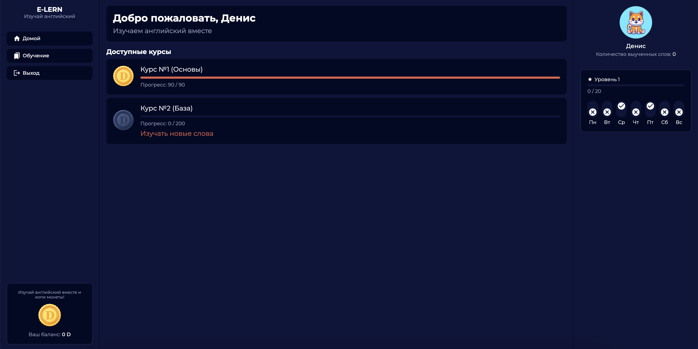

## 📚 Simle learn application



### Basic Overview - [Live Demo](https://e-learn-english.netlify.app/)

This simple learn english application how React with Typescript, React hooks, react Context and Styled Components.

- Backend repository [here](https://github.com/hardsmile98/backend-e-learn)

### Used Technologies:

- React, Typescript
- Redux toolkit
- Styled-components
- Eslint
- yarn, webpack

### Build/Run

#### Requirements

- Node.js
- Yarn

```javascript

/* First, Install the needed packages */
yarn

/* Then start the React app */
yarn dev

/* Then start web */
yarn dev:web

/* Then start mock server */
yarn dev:api

```
